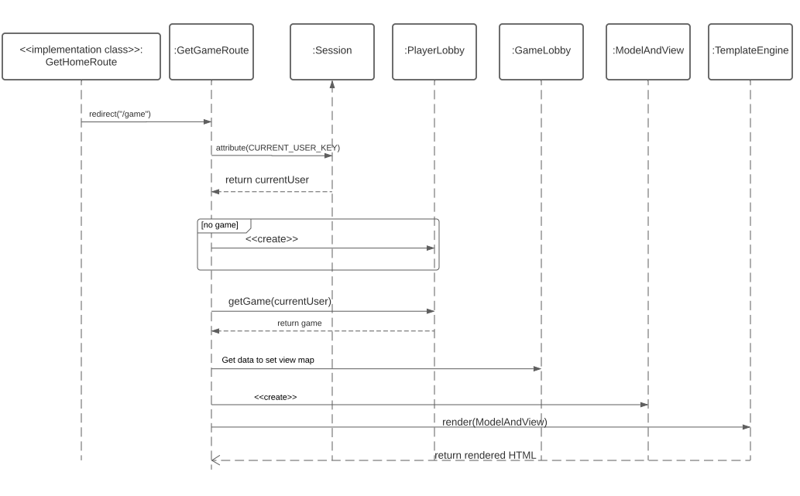

# WebCheckers Design Documentation
## Team Information
* Team name: Halle & The Bois
* Team members
  * Halle Masaryk 
  * Chris Piccoli
  * Adam Densman
  * Kushal Malhotra
  * Ben Coffta

## Executive Summary

This project creates a WebCheckers application,
a web application where players can sign in and play checkers with other players.

This application uses Java, Spark, Maven, and FreeMarker in a client-server model.

### Purpose
The purpose of this project is to create a web-based application where users can play games of checkers with each
other using a web browser.

Our most important goal is on-time delivery of high-quality software that delights the customer.

Indirectly, our goals are also to learn how to effectively work together as a team and write quality
software using software engineering skills.

### Glossary and Acronyms

| Term | Definition |
|------|------------|
| Account | A user's log in information, created when they first log in. This consists of a username and an optional password. |
| User | The person that is using the application. |
| Piece | A representation of a single checkers token on the board. Has a color and belongs to a player. |
| POJO | Plain-Old Java Object. An object written only in Java, consisting of no Javascript or FreeMarker elements. |
| Player | A user who is logged in. They may be either playing or waiting to start a game of checkers. |
| Valid username | A username that begins with a capital letter, is at least twelve characters in length, consists only of alphanumeric characters and spaces, and does not end with a space. A valid username can be used as the username for an account. |
| Invalid username | A username that does not meet one or more of the requirements to be considered a valid username. An invalid username cannot be used as the username for an account. |
| Replay | A saved recording of a game that has already been completed. It can be reviewed turn-by-turn. |
| MVP | Minimum Viable Product. This includes signing in and out, playing a game (including moving pieces, capturing pieces, and kinging pieces), and resigning from games. |
| UI | User interface. Includes the client-side UI and the server-side UI. |
| Client-side UI | The webpages that the user views when using the application. |
| Server-side UI | The server-side components responsible for rendering and delivering the client-side UI for the user, as well as handling HTTP requests from the user. This includes the FreeMarker templates used to render the pages and the Spark routes used to deliver them. |

## Requirements

This section describes the features of the application.

The product supports an Account System, where players can challenge other players to a game of checkers. 

Once in a game, the user is able to play a complete game of checkers. Players can also review replays of any game
 (regardless of whether or not they were one of the players involved in that game).

### Definition of MVP
The Account System is fully functional, and any two players can play a complete game of checkers.

### MVP Features
#### Account System
* Signing in
* Signing out
* Creating accounts

#### Player Gameplay
* Making moves
* Kinging pieces
* Capturing Pieces

### Roadmap of Enhancements
 * Saving replays
 * Viewing replays
 
## Application Domain

This section describes the application domain.

Players start on the homepage of the web application, where they can sign in. From there, they can choose to start a
 game with another player. Once in a game, each player can see whether it is their turn or not. If it is not their
  turn, then they must wait until their opponent finishes their turn. If it is their turn, then they can move one
   piece via drag-and-drop (according to the American checkers rules).
   
Moving a piece to "jump" an opponent's piece will capture the opponent's piece and remove it from play. (You cannot
 jump over pieces of your own color). If jumping over a piece places your piece in a position from which it can capture
  another piece, then you must also capture that piece. Once a player captures all their opponent's pieces, that player
   wins. 

If a player moves a piece all the way to the opposite row (the top of the board from their perspective), then that
 piece becomes a king. Unlike normal pieces, which can only move diagonally forwards, kings can move diagonally both
  forwards and backwards.

The homepage also shows a list of all games that have been completed, including the names of the players involved.
 Players can click on a game in the list to view an interactive replay of the game, which shows each move as it is
  made. The player viewing the replay can navigate through the move history of the game both forwards and backwards.

## Architecture and Design

This section describes the application architecture.

### Summary

The following Tiers/Layers model shows a high-level view of the webapp's architecture.

As a web application, the user interacts with the system using a
browser.  The client-side of the UI is composed of HTML pages with
some minimal CSS for styling the page.  There is also some JavaScript
that has been provided to the team by the architect.

The server-side tiers include the UI Tier that is composed of UI Controllers and Views.
Controllers are built using the Spark framework and View are built using the FreeMarker framework.  The Application and Model tiers are built using plain-old Java objects (POJOs).

Details of the components within these tiers are supplied below.

### Overview of User Interface

This section describes the web interface flow; this is how the user views and interacts
with the WebCheckers application.

When the user opens the browser and navigates its way to the website, and the UI controller then handles the 
GET "/" request by sending a home.ftl to the browser. Once the user is on the homepage, and he clicks on
sign in the GetSignInRoute handles the http request GET "/signin" and the user is prompted with a
signin page. After the user is signed the PostSignInRoute controller redirects the user to the homepage where the 
user can choose to play with a list of players or sign out. If the user signs out the GetSignoutRoute redirects the 
user to the homepage. If the user chooses to play with a player the GetGameRoute controller redirects the user to 
the game page. If the user loses, wins or chooses to end the game the user is redirected to the homepage where the user
can choose to play another game.

#### Account System State Chart

This statechart shows the operation of the account system, including how signing in and signing out alter the state
 of the application. It shows which HTTP requests are made during each transition, as well as which pages are
  rendered.

##### Homepage (signed-out)

A user's session begins at the homepage, in the signed-out state. The user is shown a link to the `/signin` page;
 clicking it sends an HTTP `GET` request to the `/signin` URL.

##### Sign-in

The `/signin` page contains a web form with username and password fields. Filling out the fields and clicking the
 "log in" button sends an HTTP `POST` request containing the form's contents.

If the user enters a valid username that is not currently in use by someone else and either has no associated
 password or the password the user enters is correct, the user is signed in and redirected back to the homepage in
  the signed-in state.

If the user enters an invalid username, a username that is already in use by someone else, or a username that has a
 password associated with it (and the password they enter is incorrect), the user is redirected back to the `/signin`
  page, and an appropriate error message is displayed.

##### Homepage (signed-in)

The homepage in the signed-in state shows links with each of the other signed-in players' names, which the user can
 click to start a game. (If the user clicks a player who is already in a game, they are returned to the homepage, and
  an appropriate error message is displayed.) It also shows a list of all the games that have been played to
   completion. The user can click a completed game in the list to view an interactive replay of the game.

When the user is signed in, the link to the `/signin` page no longer appears. Instead, the navigation bar at the top of
 every page displays the player's username, a link to the `/accountDetails` page, and a link to sign out.

> Note: For simplicity, the state diagram shows these links as if they only appeared on the homepage. However, these
> links actually appear at the top of every page in the application, not just the homepage. 

##### Sign-out

Clicking the "Sign out" link sends an HTTP `POST` request to the `/signout` URL. This signs the user out, removing
 them from the list of players ready to start a game with and returning them to the homepage in the signed-out state.

##### Account Details

Clicking the link to the `/accountDetails` page sends an HTTP `GET` request to the `/accountDetails` URL. The
 `/accountDetails` page shows a web form with several options, including changing their username and password and
  deleting their account.

If the user enters a valid username and a password into the "New username" and "New password" fields and clicks the
 "Change log in info" button, their account's username and password are updated to the ones they entered. (If they
  left the "New password" field blank, the password is removed from their account). They are then redirected back to
   the homepage in the signed-in state.

If the user enters an invalid username or a username that is already taken into the "New username" field and clicks
 the "Change log in info" button, nothing happens, and they are redirected to the `/accountDetails` page, where an
  appropriate error message is displayed.

If the user chooses to delete their account and enters their username as confirmation, their account is deleted,
 freeing up their username for anyone else to use, and they are returned to the home page in the signed-out state.
 
If the user chooses to delete their account but does not enter the correct username, nothing happens, and they are
 redirected back to the `/accountDetails` page where an appropriate error message is displayed.

#### Replay feature Sequence Diagram

This sequence diagram shows the flow of how the replay feature works when the user clicks on one of the games in the
 replay list. It also shows the flow of what happens when the user clicks on the "Next" button to see the next move
  in the replay.

### UI Tier

The UI tier handles the Server-side application of the project. The UI tier has different controller classes to control
the different http requests that are generated by the client-side. Each class in the UI tier handles a different HTTP
request. The UI tier is mainly divided into two types of HTTP requests: `GET` and `POST`. The `GetGameRoute`, `GetHomeRoute`,
`GetSignInRoute`, and the `GetAccountDetailsRoute` all handle HTTP `GET` requests. All of the classes starting with
 "Post" (`PostAccountDetailsRoute`, `PostBackUpMoveRoute`, `PostCheckTurnRoute`, `PostResignGameRoute`, `PostSignInRoute`
 , `PostSignOutRoute`, `PostSubmitTurnRoute`,  `PostReplayNextTurnRoute`, `PostReplayPreviousRoute`, and 
 `PostValidateMoveRoute`) handle HTTP `POST` requests. 

First when the user is first opening the website, the browser sends a `GET /` request to the `WebServer` which is handled 
by the `GetHomeRoute`. After the user is on the homepage and clicks on "sign in", the browser sends a `GET /signIn` request 
which is then handled by the `GetSignInRoute`. 

After the user is signed in, the submission of the sign-in form is handled by the `PostSignInRoute` and the user is
 redirected to the homepage. When the user is signed in and there are any available players to play a game with, and
  when a user clicks on a username, the user gets redirected to the `/game` page which is handled by the `GetGameRoute` and
   a `game.ftl` page is loaded.

When the user is in the game and makes a move on the board, the `PostValidateMoveRoute` validates to see if it's a valid 
move and displays a message. After when the user makes a move and then submits the move, that is handled by the 
`PostSubmitTurnRoute`. If a user makes a move and if it's a valid move and when the user then backs up, the 
`PostBackUpMoveRoute` backs up the move. When the user clicks on the "resign" button, the HTTP `POST` request is
 handled by the `PostResignGameRoute` and the user is redirected back to the homepage.  

### Application Tier
The Application tier of our architecture contains four classes: `AccountManager`, `GameLobby`, `PlayerLobby`, and
 `UsernameValidator`.

The `AccountManager` contains information on all the user accounts that exist, whether they are currently signed in
 or not. It provides functionality relating to checking passwords, as well as changing passwords and usernames. In
  this way, login names and passwords are preserved across logging in and out. 

The `PlayerLobby` is similar to the `AccountManager`, but instead of containing information on all user accounts, it
 only concerns itself with user accounts that are currently signed in. It deals with the relationships between users
  and games, providing functionality like checking whether a given user is currently in a game, listing all currently
   signed-in users, and managing the associations between `Player` objects and the `GameLobby` objects they are
    currently playing in.

The `GameLobby` consists of all the relevant information about a single game of checkers. It records each game's
 unique game ID, as well as which two players are involved, the game board used in the game, and whether or not the
  game has been completed yet (and if so, the reason for its completion: capture of all the pieces, resigning, or
   elimination of all valid moves).

When the server starts, a single `AccountManager` instance is created to keep track of user accounts, and a single
 `PlayerLobby` instance is created to keep track of signed in users. Each time a new game begins, a corresponding new
  `GameLobby` is instantiated to represent that particular game. The `GameLobby` remains even after the game is
   complete, in order to allow the clients to display their "game over" pages with the final results of the game.

The `UsernameValidator` handles determining whether a potential username is valid or invalid. (A username is considered
 valid if it begins with a capital letter, it is at least twelve characters in length, it consists only of
  alphanumeric characters and spaces, and it does not end with a space.) `UsernameValidator` also provides the
   informational message describing the requirements for a valid username. This is done so the message displayed when
    an invalid username is entered can be consistent across all of the pages it appears on.

### Model Tier
The model tier handles the inner workings of the game functionality. This includes anything related to making moves,
jumps, etc. The model contains the game, while the application and UI give it commands and interact with it. In this
project, the model tier is composed of the following classes: BoardView, Move, MoveValidator, Piece, Player, Position,
Row, and Space. This is also where object oriented design is best shown in the project, as no other tier contains any
objects that we created. These objects make up the board and the pieces as well as help govern the rules of the game
to allow for the full checkers experience. 

`BoardView` is used to hold the spaces of the board and the pieces that are on it. A copy of boardView is held by each
player to show the board from their perspective

`Move` holds a single move made on the board, consisting of a starting position and ending position

`MoveValidator` checks if a move is legal for the kind of piece it is and the implementation of the rules of checkers.
This class governs the rules of moves, jumps, and captures

`Piece` is a single piece on the board. It can be turned into a king if it reaches the last row of the board

`Player` is one of the two people playing the game of checkers

`Position` is the coordinates of a piece, consisting of the row and column

`Row` is the row of the board 

`Space` is a single location on a board 

### Design Improvements

* Poor expansion for future GameModes/Views
    * Create GameLobby superclass
        * GameReplay would extend this class rather than GameLobby
* GameLobby does too many different jobs
    * Several methods in GameLobby should be moved to a model class
    * Move KingPieces should be in a new class
* MoveValidator has many complex functions, with a wide breadth of functions
    * should have less jobs and more geared towards only move validation
* GetGameRoute handles too much logic
    * split starting a new game and displaying a current game in progress into two routes
* PostAccountDetailsRoute handles too much logic, making it have very high complexity
    * Should be refactored into more than one route to separate responsibilities 

## Testing

### Acceptance Testing

#### Feature Tests passed:
* Player sign in
* Start a game
* Capture pieces
* Make move
* Resign game
* King pieces
* Create account
* Sign out
* Updated account name requirements
* Resign game
* Replay

#### Tests needed:

* (None)

#### Known Issues

* Game does not check for an end game state if all possible moves have been exhausted

### Unit Testing and Code Coverage
We wrote the unit tests for the classes we felt were the most important to the functioning of the project.
The code coverage we achieved with our unit tests was 81% of instructions and 68% of branches.
We selected a target coverage of 80%, which we are currently meeting.

#### Application

 * CreateAccountTest
 * GameLobbyTest
 * GameReplayTest
 * PlayerLobbyTest
 * SaveReplayTest
 * UsernameValidatorTest
 
#### Model

 * BoardViewTest
 * MoveValidatorTest
 * PieceTest
 * SpaceTest
 * MoveTest **(missing)**
 * PositionTest **(missing)**

#### UI

 * GetAccountDetailsRouteTest
 * GetGameRouteTest
 * GetHomeRouteTest
 * GetReplayRouteTest
 * GetSignInRouteTest
 * GetStopReplayRouteTest
 * PostAccountDetailsRouteTest **(missing)**
 * PostBackUpMoveRouteTest
 * PostCheckTurnRouteTest
 * PostReplayNextRouteTest
 * PostReplayPreviousRouteTest
 * PostResignGameRouteTest
 * PostSignInRouteTest
 * PostSignOutRouteTest
 * PostSubmitTurnRouteTest
 * PostValidateMoveRouteTest
 * TemplateEngineTester
 * WebServerTest
 
### Analysis of Code Metrics

#### Metrics Profiles

##### Chidamber-Kemerer metrics
All of these metrics are within the thresholds suggested by the MetricsReloaded plugin. See [Chidamber-Kemerer.csv](Metrics/Chidamber-Kemerer.csv) for the analysis results.

##### Complexity metrics

Our package-level, module-level, and project-level metrics pass the thresholds suggested by MetricsReloaded. Three of our classes fail to meet the class-level metrics thresholds (GameLobby, MoveValidator, and PostAccountDetailsRoute). Seven of our methods fail to meet the method-level metrics thresholds (GameLobby.kingPieces, MoveValidator.ValidateMove, MoveValidator.isAvailableCapture, MoveValidator.pieceCanCapture, GetGameRoute.handle, PostAccountDetailsRoute.handle, and PostSignInRoute.handle).
See [Complexity.csv](Metrics/Complexity.csv) for the complete analysis results and [Complexity Threshold Failures.csv](Metrics/Complexity Threshold Failures.csv) for only those results that exceed the thresholds suggested by the MetricsReloaded plugin.

##### Javadoc coverage metrics

All of these metrics are within the thresholds suggested by the MetricsReloaded plugin. See [Javadoc Coverage.csv](Metrics/Javadoc Coverage.csv) for the analysis results.

##### Lines of code metrics

All of these metrics are within the thresholds suggested by the MetricsReloaded plugin. See [Lines of Code.csv](Metrics/Lines of Code.csv) for the analysis results.

##### Martin packaging metrics

All of these metrics are within the thresholds suggested by the MetricsReloaded plugin. See [Martin Packaging Metrics.csv](Metrics/Martin Packaging Metrics.csv) for the analysis results.

#### Complexity Metrics
 
##### Application
The module overall is within the complexity requirements for Cyclomatic complexity.
 The only problem class is GameLobby is the class in this module that requires the most refactoring.  It has the highest weighted method complexity of the entire project at 50.  22 points above any other class.  A few of the methods in GameLobby should likely be extracted and added to a model class.  For example the highest complexity function in GameLobby is kingPieces which iterates through the boards contained in GameLobby.  This game rule being performed by an application tier class is poor design.

##### Model

The module overall is within the complexity requirements for Cyclomatic complexity. 

Move validator is still too large of a class.  The functionality from Move Validator needs to be split up into one or more different classes. The Response For Class is 45 right now. It would be better if we could get that down. Putting the methods in a new class would make the RFC go down and make the project more organized. 

##### User Interface

The module overall is within the complexity requirements for Cyclomatic complexity.

GetGameRoute handles both starting a new game and displaying a game in progress. This makes the route class unnecessarily complicated (depending on which URL parameters are specified, it runs two completely different, unrelated paths of execution). GetGameRoute’s handle method also exceeds MetricsReloaded’s threshold for the “Complexity metrics” profile; the route’s double-functionality is likely part of the reason for this. Ideally, GetGameRoute should be split into two separate routes, each with their own URL: one to handle starting a game, and one to handle displaying a game in progress.

PostAccountDetailsRoute needs refactoring since it has the highest average operation complexity of 4.67. The handle method inside this route has the highest cyclomatic complexity of the entire project at 17. That is because this method has too many if statements and logical expressions. This class’s control flow is very ill-structured and could be refactored to lower the cyclomatic complexity.

#### Code Coverage

##### Application

* Classes that had the highest complexity typically were not as well tested. These classes are usually fundamental to the program’s execution, such as moveValidator, so any bugs within these classes are likely to be more severe and detrimental to the program overall 
    * MoveValidator really should have had higher coverage due to how essential it is to the game. It has 73 percent code coverage
* Model tier met our goal of 80 percent code coverage

##### User Interface

* UI tier did not meet our goal of having every tier be at least 80 percent tested
* We had entire classes that went untested or extremely low coverage, meaning those classes could potentially have bugs or negatively affect other classes
    * postAccountDetailsRoute